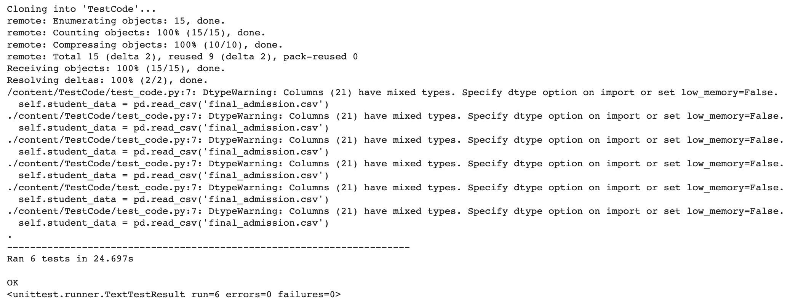

# Unit Testing for Student Code

## Description

This repository contains a unit test script (`test_code.py`) designed to validate code in a Data Science project. The project involves data manipulation and analysis using Python, Pandas, and other relevant libraries.

## How to Use

### Clone the Repository
Clone this repository into your Google Colab environment:

```python
!git clone https://github.com/Brritany/TestCode.git
```

### Import and Run the Unit Tests
After cloning, import the `TestCode` class from `test_code.py` and run the unit tests as follows:

```python
from TestCode.test_code import TestCode
import unittest

suite = unittest.TestLoader().loadTestsFromTestCase(TestCode)
unittest.TextTestRunner().run(suite)
```

## Test Cases

The unit tests include the following:

1. `test_discharge_summary`: Checks if all 'Discharge summary' records are filtered from NOTEEVENTS.
2. `test_merged_data`: Confirms whether the columns 'SUBJECT_ID' and 'HADM_ID' exist in the DataFrame, indicating successful merging of NOTEEVENTS, PATIENTS, and ADMISSIONS tables.
3. `test_final_admission`: Ensures that each 'SUBJECT_ID' appears only once in the final `final_admission.csv`.
4. `test_exclude_newborn`: Checks if all newborns have been excluded.
5. `test_exclude_dih`: Checks if all in-hospital deaths have been excluded.
6. `test_final_count`: Ensures that the final `final_admission.csv` has 32,174 records (as per your setup).

## Requirements

- Python 3.x
- Pandas

## Author

Yong Zhen Huang

## Pass Image


